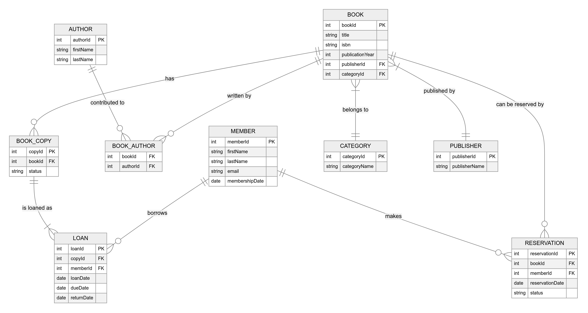

# Library Management System - Homework 1

This repository contains the implementation of a Spring Boot application developed as part of the Homework 1 assignment for the Distributed Systems course at Vilniaus Gedimino Technikos Universitetas.

## Overview

The project is a single Spring Boot application that provides RESTful export endpoints for library entities (books, authors, members). It uses Spring Data JPA with an H2 in-memory database, and JAXB for marshaling data to XML.

## Prerequisites

- Java 17  
- Maven  
- Git  

## Running the Application

1. **Run**  
   ```bash
   mvn spring-boot:run
   ```
   The embedded Tomcat server will start on port 8080.

2. **H2 Console**  
   - URL: `http://localhost:8080/h2-console`  
   - JDBC URL: `jdbc:h2:mem:librarydb`  
   - User: `sa` (no password)

3. **Actuators**  
   - Health: `http://localhost:8080/actuator/health`  
   - Full list: `http://localhost:8080/actuator`

## REST Endpoint

### GET `/export`

- **Query Parameters**  
  - `entity` (required): `books` | `authors` | `members`  
  - `title` (optional, books only): substring filter on book title  

- **Behavior**  
  1. Fetches matching entities from the H2 database via Spring Data JPA repositories.  
  2. Wraps them in a JAXB-annotated wrapper class (`BooksWrapper`, `AuthorsWrapper`, or `MembersWrapper`).  
  3. Marshals to XML (formatted) into the working directory as `<entity>_export.xml` (e.g. `books_export.xml`).  
  4. Returns the absolute file path in the HTTP 200 response body.

- **Example**  
  ```bash
  curl "http://localhost:8080/export?entity=books&title=1984"
  # -> /path/to/project/books_export.xml
  ```

## Screenshots

### ER Diagram of Library Management Data Model



## License

This project is licensed under the MIT License.  