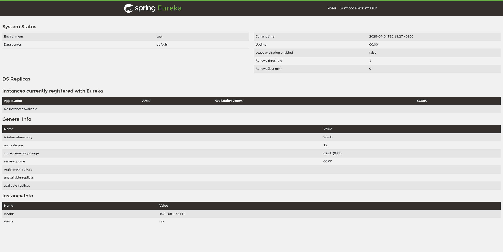
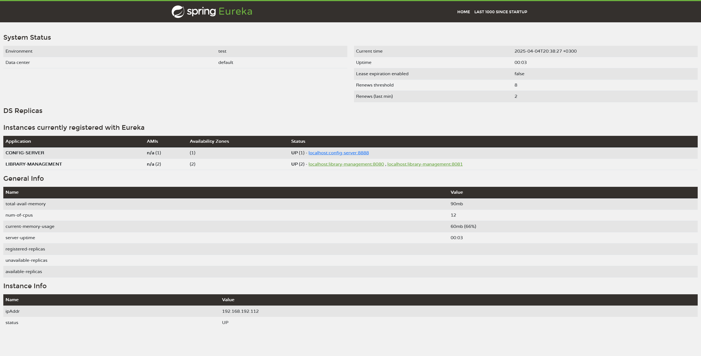

# Library Management System - Homework 2

This repository contains the implementation of a Spring Cloud distributed microservices application developed as part of the Homework 2 assignment for the Distributed Systems course at Vilniaus Gedimino Technikos Universitetas.

## Overview

The project consists of the following modules:

- **discovery-service**: A Spring Cloud Discovery Service using Netflix Eureka that registers and discovers microservices.
- **config-server**: A Spring Cloud Config Server that provides centralized configuration management.
- **microservice**: A microservice application adapted from the previous homework task for library management.

## Prerequisites

- Java 21
- Maven
- Git

## Running the Applications

1. **Discovery Service**
    - Navigate to the `discovery-service` directory.
    - Run the application with:
      ```bash
      mvn spring-boot:run
      ```

2. **Config Server**
    - Navigate to the `config-server` directory.
    - Run the application with:
      ```bash
      mvn spring-boot:run
      ```

3. **Microservice**
    - Navigate to the `microservice` directory.
    - Run the application with:
      ```bash
      mvn spring-boot:run
      ```
    - To run additional instances of the microservice (for client-side load balancing), specify a different server port. For example:
      ```bash
      mvn -Dspring-boot.run.arguments="--server.port=8081" spring-boot:run
      ```

## Screenshots

### Spring Cloud Netflix Eureka Server Console



### Client-Side Load Balancer with Multiple Microservice Instances



## License

This project is licensed under the MIT License.